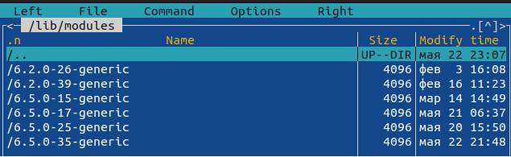
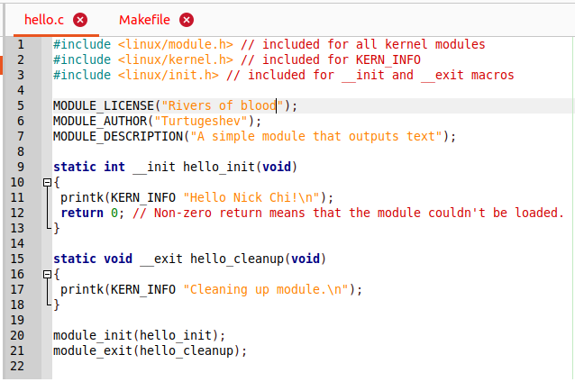
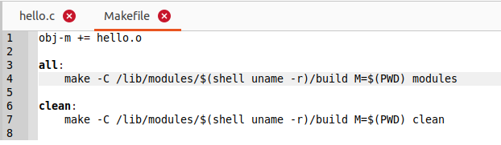
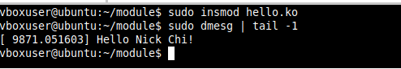
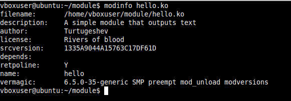
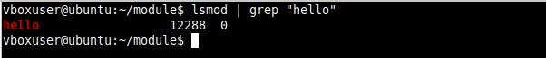

# Как написать свой собственный модуль ядра Linux
## Установка заголовков Linux
apt-get install build-essential linux-headers-$(uname -r)  
- Версии заголовок ядер  

   
## Cоздайте следующий модуль hello.c.
- Введите лицензию, автора и описание того что делает модуль  

   

## Cоздайте Makefile  

   

## Введите команду insmod hello.ko. 
- `insmod` вставит новый модуль в ядро  
- Ввести команду `dmesg | tail -1` для просмотра системного журнала  

  

## Команда modinfo hello.ko просмотр информации о параметрах модуля.  

 

## Команда lsmod hello.ko | grep "hello" чтобы посмотреть, что модуль находится в системе.

 

## Команда rmmod hello.ko удаляет модуль из ядра.
- Ввести команду `dmesg | tail -1` , чтобы убедиться что модуль действительно был удален.   

 
