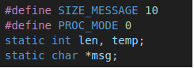
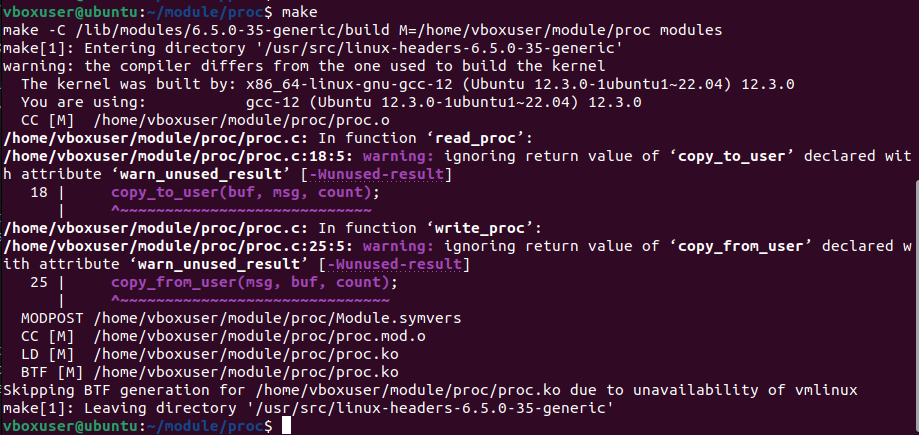
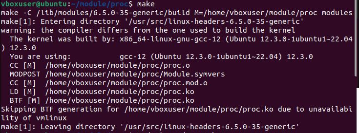
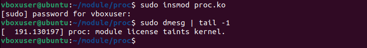
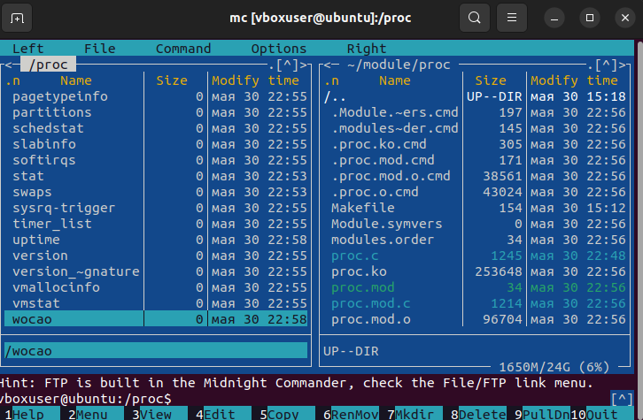
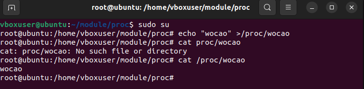
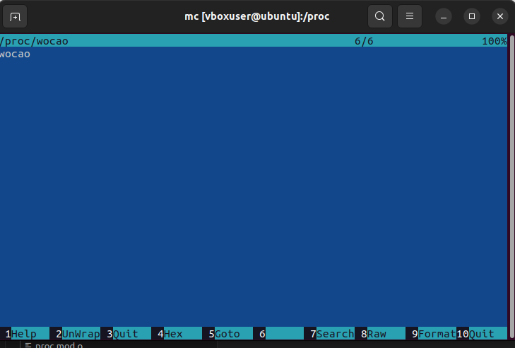

# Модуль чтения и записи Proc в ядре Linux  
## Cоздайте следующий модуль proc.c
- Введите лицензию, автора

   
## Адаптировать для своей версии ядра (Структура обработчиков). Избавиться от харкода (маг чисел) и изолировать переменные модуля (static)
- Избавились от маг чисел, и изолизовали переменные модуля  

   
- При компиляции получили сообщение о предупреждении в фунциях `copy_to_user` и `copy_from_user`, что  функции вызываются без проверки возвращаемого значения.

   
- Добавил локальную переменную `rv` для хранинения результата работы функций. Предупреждение исчезло.  

   

## Проверить, что новый модуль вставился в ядро  
- `insmod` вставит новый модуль в ядро  
- Ввести команду `dmesg | tail -1` для просмотра системного журнала  

    
- Содержимое /proc  

  
## Запись в файл и чтения wocao в системе /proc
  

  