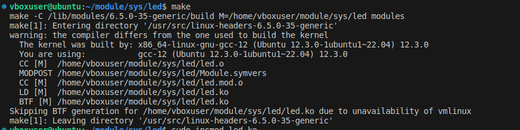
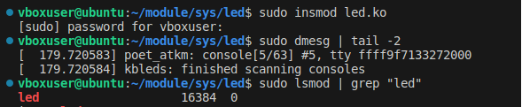

# Моргание лампочек на клавиатуре

Объеденить модуль отвечающий за миганием светодиодов на клавиатуре с модулем чтения и записи `sysfs`  

В модуль отвечающий за светодиодами добавили функции чтения и записи  `foo_show` и `foo_store`  

В функции `kbleds_init` добавили объект `example_kobject`, представляющий каталог в sysfs, который будем использовать для чтения и записи значений светодиодов.

## Компилируем и проверяем, что новый модуль вставился в ядро  
   

  
## Проверка модуля 

- echo 1 > setting_leds  

  

- echo 2 > setting_leds  

  

- echo 3 > setting_leds  

  

- echo 4 > setting_leds  

  

- echo 5 > setting_leds  

  

- echo 6 > setting_leds  

  

- echo 7 > setting_leds  

  

При остальных значения миганий нет  

