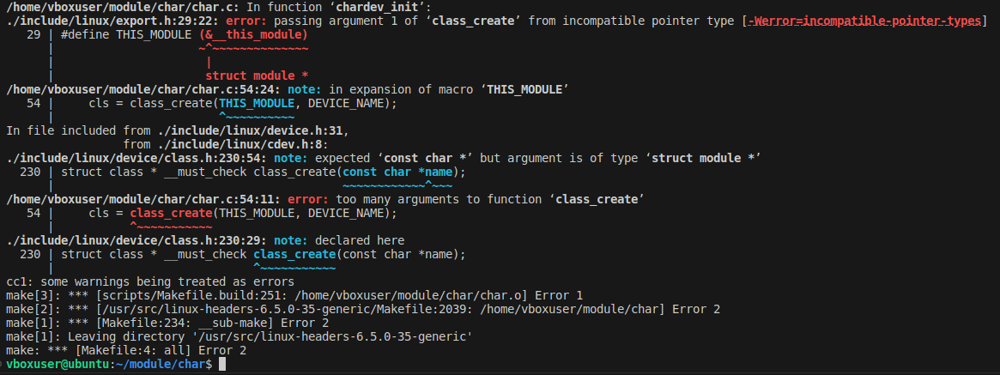
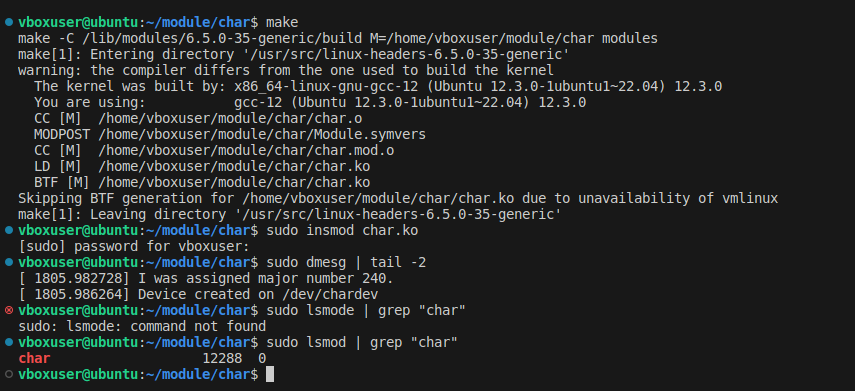
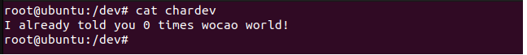

# Написать модуль ядра для своей версии ядра, который будет обмениваться информацией с userspace через chardev. 
- Берем исходник и компилируем его.  

  

Ошибка возникают из-за использования функции `class_create`. Эта функция ожидает один аргумент `const char`. Исправляем и заново компируем.  

  

Загружаем модуль в ядро. Проверяем логи и с помощью команды `lsmod` ищем наш модуль.

## Проверка модуля 

  

