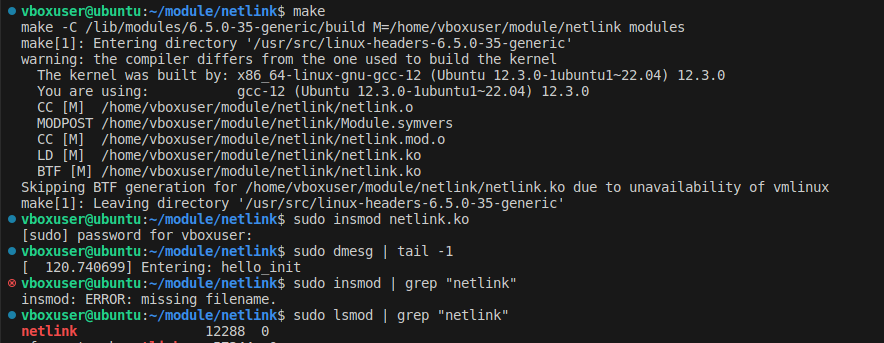
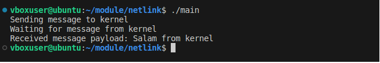

# Написать модуль ядра для своей версии ядра, который будет обмениваться информацией с userspace через netlink. 

- Компилируем и загружаем модуль в ядро. Проверяем логи и с помощью команды `lsmod` ищем наш модуль.

  

Компилируем код программы user space с помощью gcc.  

## Проверка модуля 

  